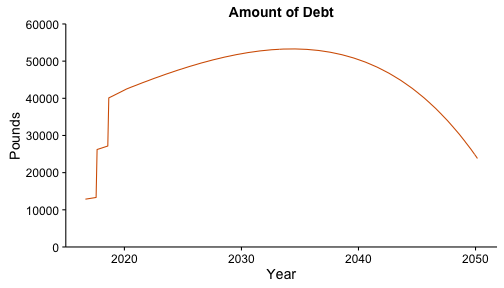

## Introduction

This app lets you see how much a university student in England or Wales is likely to have to repay on their student loan, and for how long. A student typically borrows their tuition fees and some living expenses. Interest is charged at RPI (Retail Price Index) + 3%, and repayments are automatically deducted from the student’s salary once they start earning, at a rate of 9% of everything they earn over £21,000. Any debt not paid off after 30 years is written off.

The app lets you play with these parameters:

* The annual tuition fee charged by the university. Usually it’s £9000 per year.
* What the student wants to borrow per year for living expenses. It’s capped according to household income.
* How many years the course runs for. You can select 3, 4 or 5 years.
* What annual salary the student might get when they graduate and start work.
* An estimate of the rate at which the salary might increase per year.
* Retail Price Index (RPI), an official government measure of inflation. It determines the rate at which the student is charged interest.

--- .class #id 

## Repayments for a student with a starting salary of £25,000

Amount borrowed: £38,463.00
Amount repaid: £72,439.50

--- .class #id 

## Repayments for a student with a starting salary of £40,000

Amount borrowed: £38,463.00
Amount repaid: £63,574.06

The student with the higher salary repays less in total, because they repay the debt more quickly.

--- .class #id 

## Conclusion

One interesting result that this app illustrates is that the repayment is a more dependent on the student’s salary than how much they borrow. Within certain parameters, a student repays the same amount over thirty years, even given considerable variation in the amount of debt.

Because interest is usually accruing faster that the student is paying it off, the debt will keep growing for many years, and most students will still be paying a large amount of their income towards paying off their student loan into their fifties.

This app will be useful in educating potential students about the commitment that they are about to enter into.

